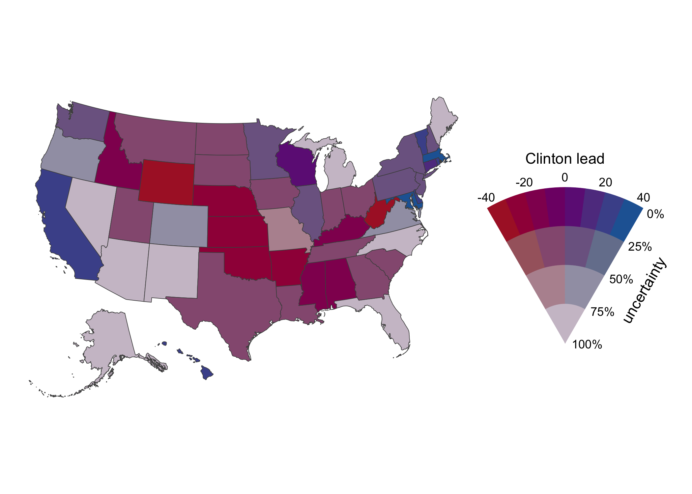

<!-- README.md is generated from README.Rmd. Please edit that file -->

# multiscales

Multivariate scales for ggplot2, written by Claus O. Wilke

## Installation

This package can be installed from github. It requires the development
version of the colorspace package. It also requires ggplot2 3.0.0, which
should be on CRAN any day now or can also be installed as development
package.

    devtools::install_github("tidyverse/ggplot2")  # ggplot2 3.0.0, to be released early July 2018
    install.packages("colorspace", repos = "http://R-Forge.R-project.org")
    devtools::install_github("clauswilke/multiscales")

This is an experimental package. Use at your own risk. API is not
stable. No user support provided.

## Examples

Visualizing both the median house value and its uncertainty for Florida
counties:

``` r
library(ggplot2)
library(multiscales)
library(colorspace)

ggplot(FL_house_values, aes(fill = zip(estimate/1000, moe/estimate))) +
  geom_sf(color = "gray30", size = 0.2) +
  coord_sf(xlim = c(-88, -79.8), ylim = c(24.1, 31.2), datum = NA) +
  bivariate_scale("fill",
    pal_carto_vsup(palette = "Sunset", rev = TRUE),
    name = c("median house\nvalues ($1K)", "uncertainty"),
    limits = list(c(0, 400), c(0, 0.4)),
    breaks = list(waiver(), c(0.05, 0.15, 0.25, 0.35)),
    labels = list(waiver(), scales::percent),
    guide = "colourfan"
  ) +
  theme_void() +
  theme(
    legend.key.size = grid::unit(0.8, "cm"),
    legend.title.align = 0.5,
    legend.justification = c(0, 0),
    legend.position = c(0.1, 0.2)
  )
```

<!-- -->

For comparison, the same plot with a univariate color scale:

``` r
ggplot(FL_house_values, aes(fill = estimate/1000)) +
  geom_sf(color = "gray30", size = 0.2) +
  coord_sf(xlim = c(-88, -79.8), ylim = c(24.1, 31.2), datum = NA) +
  scale_fill_continuous_carto(
    palette = "Sunset", rev = TRUE,
    name = "median house values ($1K)",
    limits = c(0, 400),
    guide = guide_colorbar(
      direction = "horizontal",
      label.position = "bottom",
      title.position = "top",
      barwidth = grid::unit(2.0, "in")
    )
  ) +
  theme_void() +
  theme(
    legend.title.align = 0.5,
    legend.justification = c(0, 0),
    legend.position = c(0.1, 0.3)
  )
```

<!-- -->
